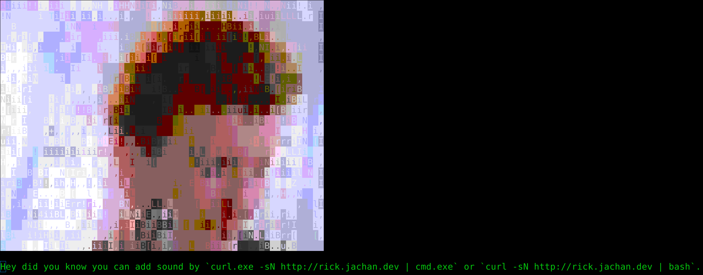

# RickASCII - RickRoll using curl

Plays rick astley's never gonna give you up in ANSI art.
Pipeing curl's output to `bash` or `cmd.exe` will play audio.

## Try on Linux/Mac/Android using:
```bash
curl -sN http://rick.jachan.dev | bash
```
or
```bash
curl http://rick.jachan.dev
```
For *nix systems you need `which`, `cat`, and one of `aplay`, `afplay`, `paplay`, `play`.

## Try on Windows using:
```powershell
curl.exe -sN http://rick.jachan.dev | cmd.exe
```
or
```powershell
curl.exe -sN http://rick.jachan.dev
```

### [Example Video](https://www.youtube.com/watch?v=V04kmtTIMEk)


